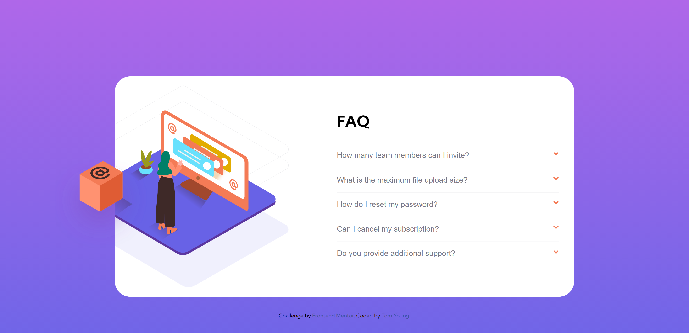

# Frontend Mentor - FAQ accordion card

This is a solution to the [FAQ accordion card challenge on Frontend Mentor](https://www.frontendmentor.io/challenges/faq-accordion-card-XlyjD0Oam).

## Table of contents

- [Overview](#overview)
  - [Links](#links)
  - [Screenshots](#screenshots)
- [My process](#my-process)
  - [Built with](#built-with)
- [Author](#author)

## Overview

### Links

- Live Site URL: [GitHubPage](https://thethomasy.github.io/FAQ-Accordion-Card/)

### Screenshots

  
  

## My process

Styling the image was very tricky, this video by [Coder Coder](https://www.youtube.com/watch?v=FboXxLxg8eo&t=4152s) was extremely helpful.

### Built with

- HTML
- SASS
- Flexbox
- Mobile-first workflow
- JS

## Author

- Frontend Mentor - [@TheThomasY](https://www.frontendmentor.io/profile/TheThomasY)
